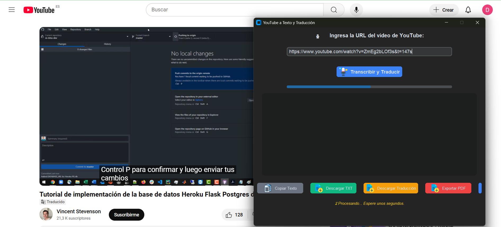
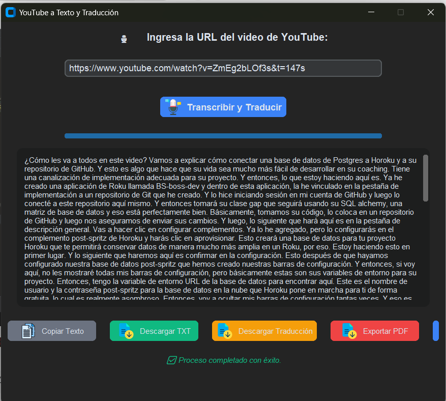

### 📌 **README.md** para tu proyecto **YouTube-to-Text**  

## 📌 **Capturas de Pantalla**  

🔹 **Interfaz Gráfica con CustomTkinter**  
  

🔹 **Ejemplo de Transcripción**  
  


# 🎬 YouTube-to-Text 🎤📜  


## 📢 Descripción  

**YouTube-to-Text** es una aplicación que permite transcribir el audio de videos de YouTube a texto.  
Además, ofrece opciones avanzadas como:  
✅ **Traducción automática** al español si el idioma original es inglés.  
✅ **Limpieza de ruido** en el audio antes de la transcripción.  
✅ **Interfaz gráfica moderna y dinámica** con animaciones.  
✅ **Exportación** de la transcripción en **PDF y CSV**.  
✅ **Copia rápida** de la transcripción al portapapeles.  

---


---

## 🚀 **Instalación**  

1️⃣ **Clona el repositorio**  


git clone https://github.com/diegoaberrio/youtube-to-text.git
cd youtube-to-text
```

2️⃣ **Crea y activa un entorno virtual**  


python -m venv venv
source venv/bin/activate  # Mac/Linux
venv\Scripts\activate  # Windows
```

3️⃣ **Instala las dependencias necesarias**  

pip install -r requirements.txt
```

⚠️ **Importante:** Necesitas tener **FFmpeg** instalado. Para instalarlo:  

- **Windows**: Descarga e instala [FFmpeg](https://ffmpeg.org/download.html) y agrega su ruta al `PATH`.  
- **Linux** / **MacOS**:  

  sudo apt install ffmpeg  # Ubuntu/Debian
  brew install ffmpeg  # macOS
  ```

---

## 🛠️ **Uso**  

🔹 **Ejecutar la interfaz gráfica:**  

python app.py
```

🔹 **Modo consola (sin GUI):**  


python venv/youtube_to_text.py
```

🔹 **Opciones en la interfaz:**  
- **Ingresar URL de YouTube**  
- **Iniciar Transcripción y Traducción**  
- **Descargar transcripción en PDF/CSV**  
- **Copiar al portapapeles**  

---

## 📦 **Estructura del Proyecto**  

```
📂 youtube-to-text
│── 📂 venv/                # Entorno virtual
│── 📂 screenshots/         # Capturas de pantalla
│── 📜 app.py               # Interfaz gráfica con CustomTkinter
│── 📜 youtube_to_text.py   # Lógica de transcripción y traducción
│── 📜 procesador_texto.py  # Procesamiento y exportación del texto
│── 📜 requirements.txt     # Dependencias del proyecto
│── 📜 README.md            # Documentación del proyecto
```

---

## 🖥️ **Tecnologías Utilizadas**  

| Tecnología        | Uso en el Proyecto |
|------------------|-------------------|
| **Python**       | Lenguaje principal |
| **yt-dlp**       | Descarga de audio de YouTube |
| **Whisper**      | Transcripción de audio a texto |
| **Deep Translator** | Traducción automática |
| **pydub**        | Procesamiento de audio |
| **customtkinter** | Interfaz gráfica moderna |
| **FPDF**         | Exportación en PDF |
| **Pandas**       | Exportación en CSV |

---

## 📌 **Futuras Mejoras**  

🚀 Agregar soporte para transcribir audios en otros idiomas.  
🚀 Integración con Google Drive para guardar transcripciones.  
🚀 Soporte para elegir entre diferentes modelos de Whisper.  

---

## 🤝 **Contribuciones**  

¡Las contribuciones son bienvenidas! Si deseas colaborar:  
1. **Haz un fork** del repositorio.  
2. **Crea una nueva rama** (`git checkout -b feature-nueva`).  
3. **Realiza cambios** y súbelos (`git commit -m "Descripción de cambios"`).  
4. **Envía un Pull Request**.  

---

## 📜 **Licencia**  

Este proyecto está bajo la licencia **MIT**.  
📄 Consulta el archivo [LICENSE](LICENSE) para más detalles.  
